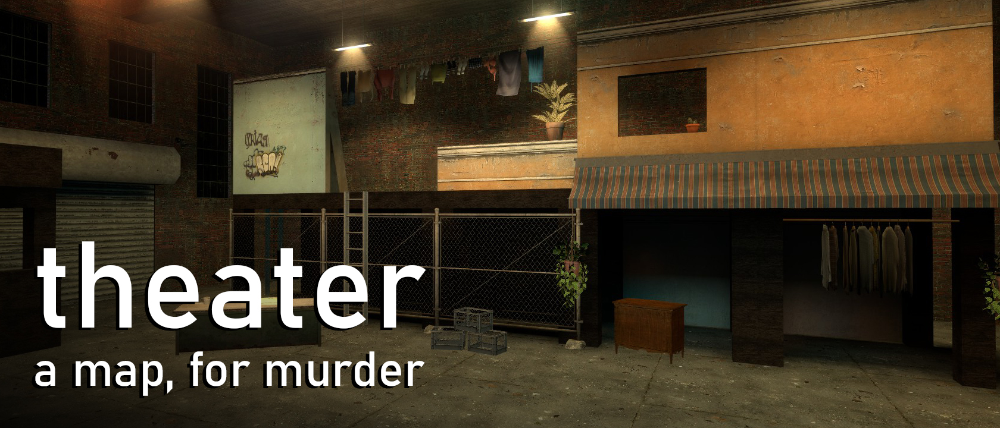

# About mu_theater
A decaying and abandoned industrial building is rented out to an acting troop for their production of "East End Endeavor", but wait! Oh no! Someone has been murdered!

A murder gamemode map developed in about a week-and-a-half for Fluffy Server's "Verticality" Mapathon.

All required content is packed into the BSP.

# Legal
The design of this map, as well as the custom assets made by myself, are licensed under the Creative Commons Attribution-NonCommercial-ShareAlike 4.0 International License. To view a copy of this license, visit http://creativecommons.org/licenses/by-nc-sa/4.0/.

## Additional content included in the .BSP, but not covered by this license is as follows:
- CSGO, Episode 2, and CS:S Content by Valve, recompiled for use with GMod's SDK.
